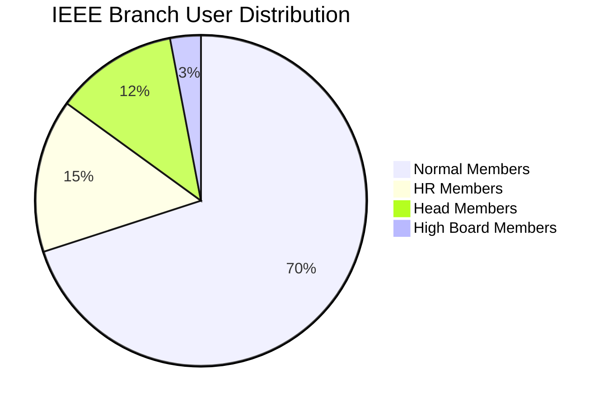

# IEEE Management System - Visual Documentation Overview

This documentation provides comprehensive visual diagrams and charts to understand the IEEE Management System's structure, user roles, permissions, and workflows.

## 📋 Document Index

### 1. [User Roles and Permissions](./user-roles-diagram.md)

- **Role Hierarchy Diagram**: Visual representation of the four user roles and their relationships
- **Permissions Matrix**: Comprehensive breakdown of what each role can and cannot do
- **System Architecture Flow**: How users navigate through the system based on their roles
- **Data Access Patterns**: Entity relationship diagram showing data structure
- **User Journey Flow**: Step-by-step user experiences for each role type

### 2. [Technical Architecture](./technical-architecture.md)

- **Component Architecture**: Frontend component structure and relationships
- **Permission-Based Access Control**: Technical implementation of role-based permissions
- **Data Flow Architecture**: Sequence diagrams showing system interactions
- **State Management Flow**: Redux store structure and data flow

### 3. [UI/UX Design Mockups](./ui-ux-mockups.md)

- **Dashboard Layouts by Role**: Customized dashboard designs for each user type
- **User Interaction Flows**: Visual workflows for key system operations
- **Responsive Design Layouts**: Mobile, tablet, and desktop layout specifications

### 4. [Permission Decision Trees](./permission-decision-trees.md)

- **Permission Decision Logic**: Flowcharts for access control decisions
- **Feature Access Matrix**: Comprehensive permission comparison across roles

## 🎯 Key Insights from the Diagrams

### Role Hierarchy

```
High Board Member (Full System Access)
    ↓
Head Member (Committee Management)
    ↓
HR Member (Member Support)
    ↓
Normal Member (Basic Access)
```

### Core Permissions Summary

| Feature               | Normal | HR                | Head              | High Board |
| --------------------- | ------ | ----------------- | ----------------- | ---------- |
| View Own Profile      | ✅     | ✅                | ✅                | ✅         |
| View Others' Profiles | ❌     | 🔸 Committee Only | 🔸 Committee Only | ✅         |
| Rate Attendance       | ❌     | ✅                | ✅                | ✅         |
| Rate Assignments      | ❌     | ❌                | ✅                | ✅         |
| Add New Members       | ❌     | ❌                | ✅                | ✅         |
| Create Committees     | ❌     | ❌                | ❌                | ✅         |
| Manage Events         | ❌     | ❌                | 🔸 Committee Only | ✅         |
| Rate Leadership       | ❌     | ❌                | ❌                | ✅         |

_Legend: ✅ Full Access, 🔸 Limited Access, ❌ No Access_

## 🔧 Implementation Guidelines

### Authentication Flow

1. User logs in with credentials
2. System verifies and returns user role
3. Frontend loads role-appropriate dashboard
4. All subsequent actions are permission-checked

## 📊 System Statistics & Metrics

### Expected User Distribution


