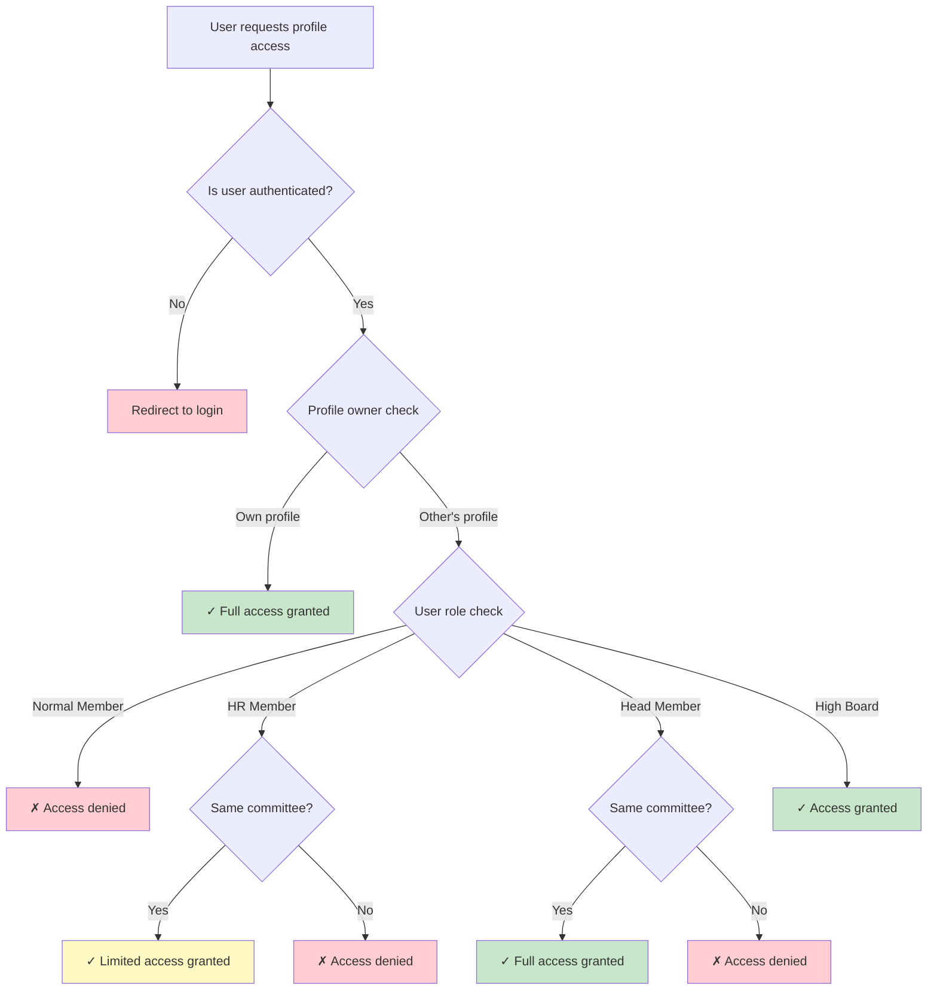
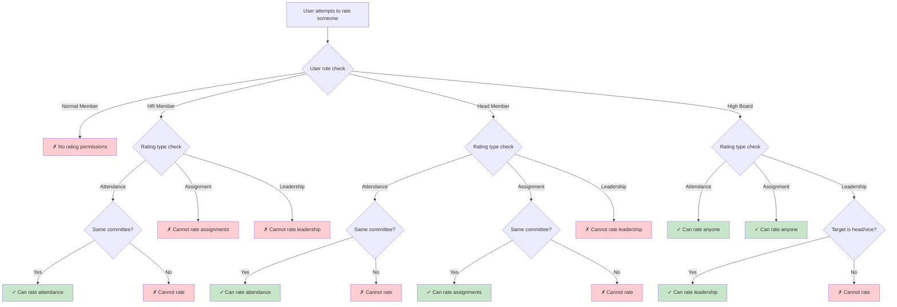
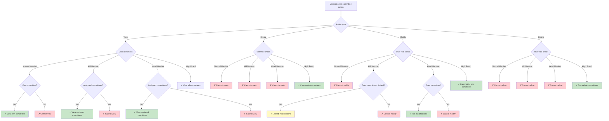

# IEEE Management System - Permission Decision Trees

## Permission Decision Logic

### Profile Access Decision Tree

```mermaid
flowchart TD
    A[User requests profile access] --> B{Is user authenticated?}
    B --> |No| C[Redirect to login]
    B --> |Yes| D{Profile owner check}
    D --> |Own profile| E[✓ Full access granted]
    D --> |Other's profile| F{User role check}

    F --> |Normal Member| G[✗ Access denied]
    F --> |HR Member| H{Same committee?}
    F --> |Head Member| I{Same committee?}
    F --> |High Board| J[✓ Access granted]

    H --> |Yes| K[✓ Limited access granted]
    H --> |No| L[✗ Access denied]

    I --> |Yes| M[✓ Full access granted]
    I --> |No| N[✗ Access denied]

    style C fill:#ffcdd2
    style E fill:#c8e6c9
    style G fill:#ffcdd2
    style J fill:#c8e6c9
    style K fill:#fff9c4
    style L fill:#ffcdd2
    style M fill:#c8e6c9
    style N fill:#ffcdd2
```

### Rating Permission Decision Tree

```mermaid
flowchart TD
    A[User attempts to rate someone] --> B{User role check}

    B --> |Normal Member| C[✗ No rating permissions]
    B --> |HR Member| D{Rating type check}
    B --> |Head Member| E{Rating type check}
    B --> |High Board| F{Rating type check}

    D --> |Attendance| G{Same committee?}
    D --> |Assignment| H[✗ Cannot rate assignments]
    D --> |Leadership| I[✗ Cannot rate leadership]

    E --> |Attendance| J{Same committee?}
    E --> |Assignment| K{Same committee?}
    E --> |Leadership| L[✗ Cannot rate leadership]

    F --> |Attendance| M[✓ Can rate anyone]
    F --> |Assignment| N[✓ Can rate anyone]
    F --> |Leadership| O{Target is head/vice?}

    G --> |Yes| P[✓ Can rate attendance]
    G --> |No| Q[✗ Cannot rate]

    J --> |Yes| R[✓ Can rate attendance]
    J --> |No| S[✗ Cannot rate]

    K --> |Yes| T[✓ Can rate assignments]
    K --> |No| U[✗ Cannot rate]

    O --> |Yes| V[✓ Can rate leadership]
    O --> |No| W[✗ Cannot rate]

    style C fill:#ffcdd2
    style H fill:#ffcdd2
    style I fill:#ffcdd2
    style L fill:#ffcdd2
    style M fill:#c8e6c9
    style N fill:#c8e6c9
    style P fill:#c8e6c9
    style Q fill:#ffcdd2
    style R fill:#c8e6c9
    style S fill:#ffcdd2
    style T fill:#c8e6c9
    style U fill:#ffcdd2
    style V fill:#c8e6c9
    style W fill:#ffcdd2
```

### Committee Management Decision Tree

```mermaid
flowchart TD
    A[User requests committee action] --> B{Action type}

    B --> |View| C{User role check}
    B --> |Create| D{User role check}
    B --> |Modify| E{User role check}
    B --> |Delete| F{User role check}

    C --> |Normal Member| G{Own committee?}
    C --> |HR Member| H{Assigned committees?}
    C --> |Head Member| I{Assigned committees?}
    C --> |High Board| J[✓ View all committees]

    D --> |Normal Member| K[✗ Cannot create]
    D --> |HR Member| L[✗ Cannot create]
    D --> |Head Member| M[✗ Cannot create]
    D --> |High Board| N[✓ Can create committees]

    E --> |Normal Member| O[✗ Cannot modify]
    E --> |HR Member| P{Own committee + limited?}
    E --> |Head Member| Q{Own committee?}
    E --> |High Board| R[✓ Can modify any committee]

    F --> |Normal Member| S[✗ Cannot delete]
    F --> |HR Member| T[✗ Cannot delete]
    F --> |Head Member| U[✗ Cannot delete]
    F --> |High Board| V[✓ Can delete committees]

    G --> |Yes| W[✓ View own committee]
    G --> |No| X[✗ Cannot view]

    H --> |Yes| Y[✓ View assigned committees]
    H --> |No| Z[✗ Cannot view]

    I --> |Yes| AA[✓ View assigned committees]
    I --> |No| BB[✗ Cannot view]

    P --> |Yes| CC[✓ Limited modifications]
    P --> |No| DD[✗ Cannot modify]

    Q --> |Yes| EE[✓ Full modifications]
    Q --> |No| FF[✗ Cannot modify]

    style K fill:#ffcdd2
    style L fill:#ffcdd2
    style M fill:#ffcdd2
    style N fill:#c8e6c9
    style O fill:#ffcdd2
    style R fill:#c8e6c9
    style S fill:#ffcdd2
    style T fill:#ffcdd2
    style U fill:#ffcdd2
    style V fill:#c8e6c9
    style W fill:#c8e6c9
    style X fill:#ffcdd2
    style Y fill:#c8e6c9
    style Z fill:#ffcdd2
    style AA fill:#c8e6c9
    style BB fill:#ffcdd2
    style CC fill:#fff9c4
    style DD fill:#ffcdd2
    style EE fill:#c8e6c9
    style FF fill:#ffcdd2
```
