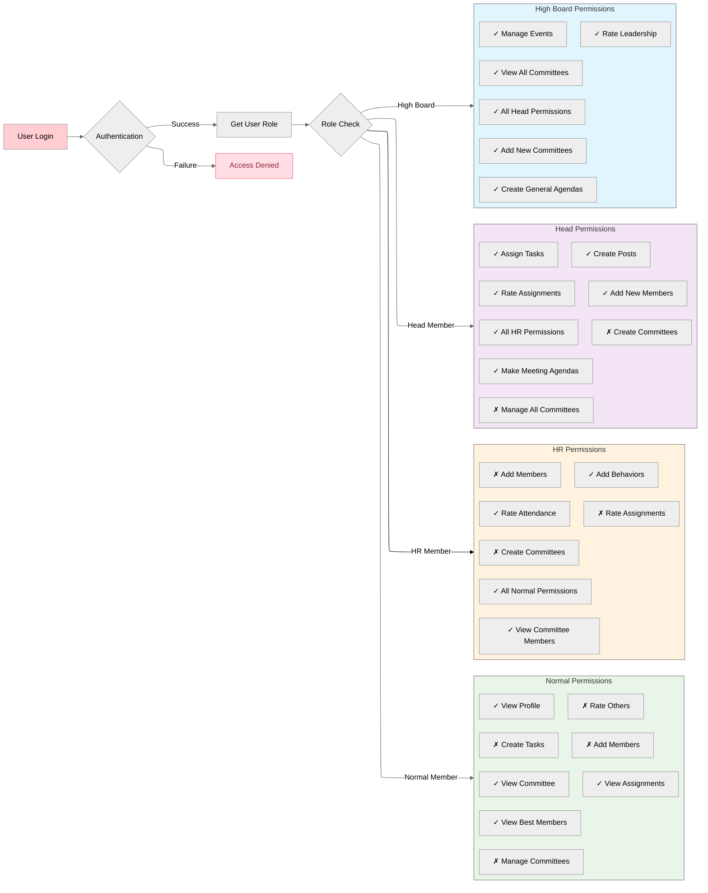
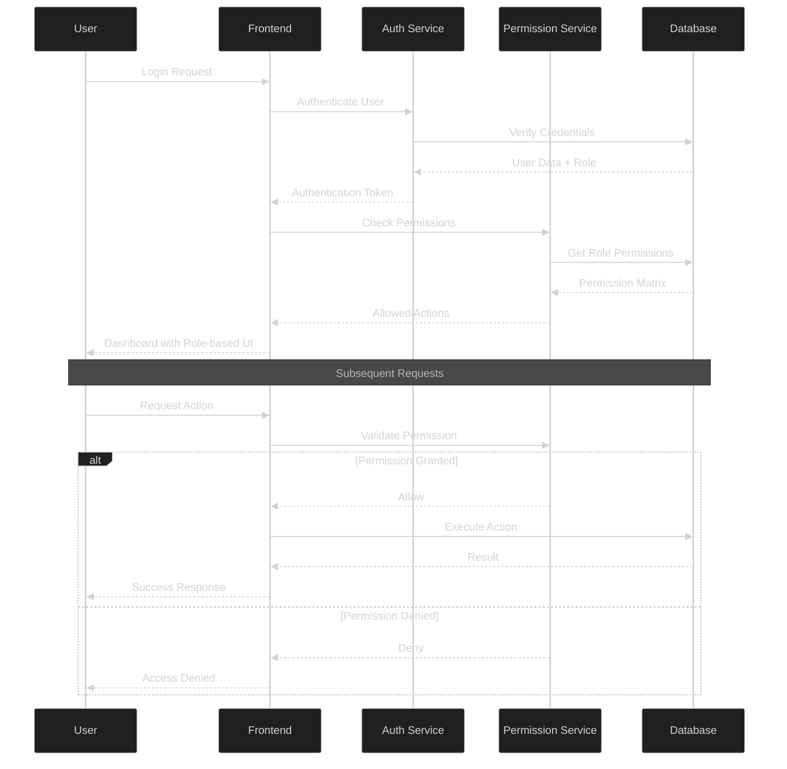

# IEEE Management System - Technical Architecture

## Permission-Based Access Control

```mermaid
---
config:
  layout: elk
  theme: neutral
  themeVariables:
    darkMode: true
---
flowchart LR
 subgraph F["Normal Permissions"]
    direction TB
        F1["✓ View Profile"]
        F2["✓ View Assignments"]
        F3["✓ View Committee"]
        F4["✓ View Best Members"]
        F5["✗ Rate Others"]
        F6["✗ Add Members"]
        F7["✗ Create Tasks"]
        F8["✗ Manage Committees"]
  end
 subgraph G["HR Permissions"]
    direction TB
        G1["✓ All Normal Permissions"]
        G2["✓ Rate Attendance"]
        G3["✓ Add Behaviors"]
        G4["✓ View Committee Members"]
        G5["✗ Rate Assignments"]
        G6["✗ Add Members"]
        G7["✗ Create Committees"]
  end
 subgraph H["Head Permissions"]
    direction TB
        H1["✓ All HR Permissions"]
        H2["✓ Rate Assignments"]
        H3["✓ Add New Members"]
        H4["✓ Assign Tasks"]
        H5["✓ Create Posts"]
        H6["✓ Make Meeting Agendas"]
        H7["✗ Manage All Committees"]
        H8["✗ Create Committees"]
  end
 subgraph I["High Board Permissions"]
    direction TB
        I1["✓ All Head Permissions"]
        I2["✓ View All Committees"]
        I3["✓ Create General Agendas"]
        I4["✓ Manage Events"]
        I5["✓ Add New Committees"]
        I6["✓ Rate Leadership"]
  end
    A["User Login"] --> B{"Authentication"}
    B -- Success --> C["Get User Role"]
    B -- Failure --> D["Access Denied"]
    C --> E{"Role Check"}
    E -- Normal Member --> F
    E L_E_G_0@-- HR Member --> G
    E -- Head Member --> H
    E -- High Board --> I
     D:::Rose
    classDef Rose stroke-width:1px, stroke-dasharray:none, stroke:#FF5978, fill:#FFDFE5, color:#8E2236
    style A fill:#ffcdd2
    style F fill:#e8f5e8
    style G fill:#fff3e0
    style H fill:#f3e5f5
    style I fill:#e1f5fe
    linkStyle 5 stroke:#000000,fill:none
    L_E_G_0

```

## Data Flow Architecture

```mermaid
---
config:
  layout: elk
  theme: dark
  themeVariables:
    darkMode: true
---
sequenceDiagram
    participant U as User
    participant F as Frontend
    participant A as Auth Service
    participant P as Permission Service
    participant D as Database

    U->>F: Login Request
    F->>A: Authenticate User
    A->>D: Verify Credentials
    D-->>A: User Data + Role
    A-->>F: Authentication Token
    F->>P: Check Permissions
    P->>D: Get Role Permissions
    D-->>P: Permission Matrix
    P-->>F: Allowed Actions
    F-->>U: Dashboard with Role-based UI

    Note over U,D: Subsequent Requests
    U->>F: Request Action
    F->>P: Validate Permission
    alt Permission Granted
        P-->>F: Allow
        F->>D: Execute Action
        D-->>F: Result
        F-->>U: Success Response
    else Permission Denied
        P-->>F: Deny
        F-->>U: Access Denied
    end
```
