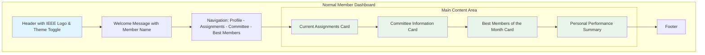
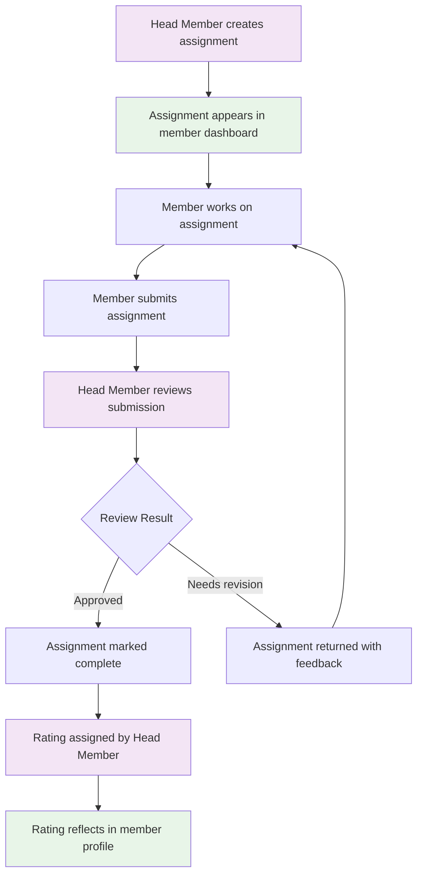
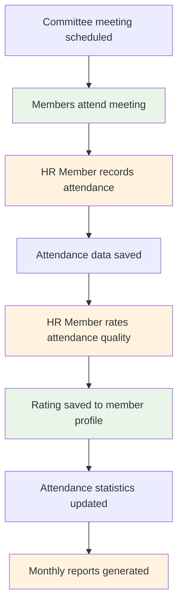
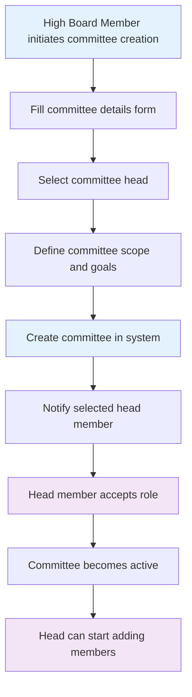
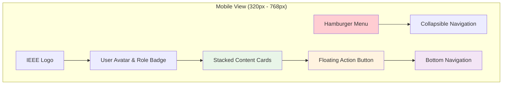
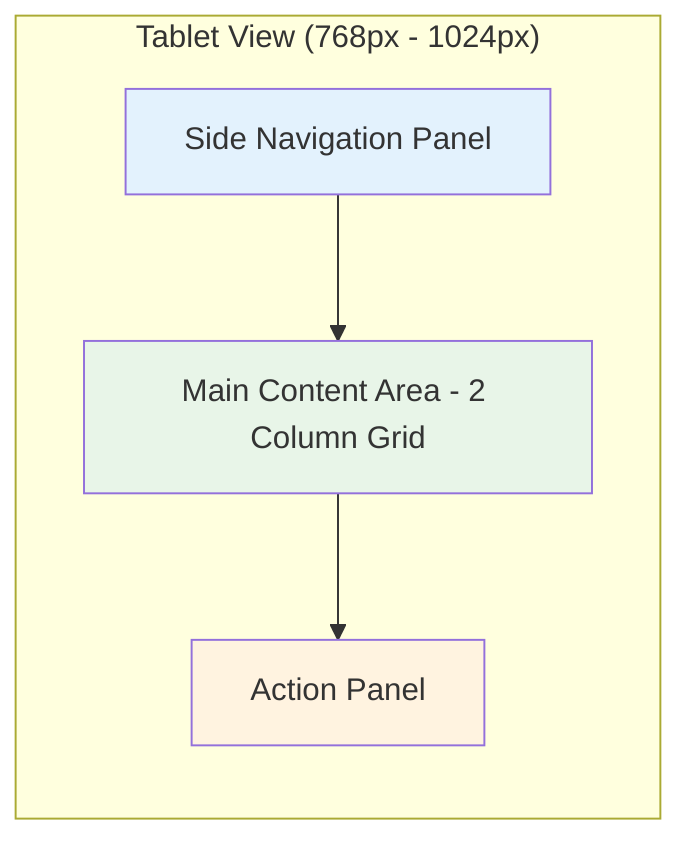
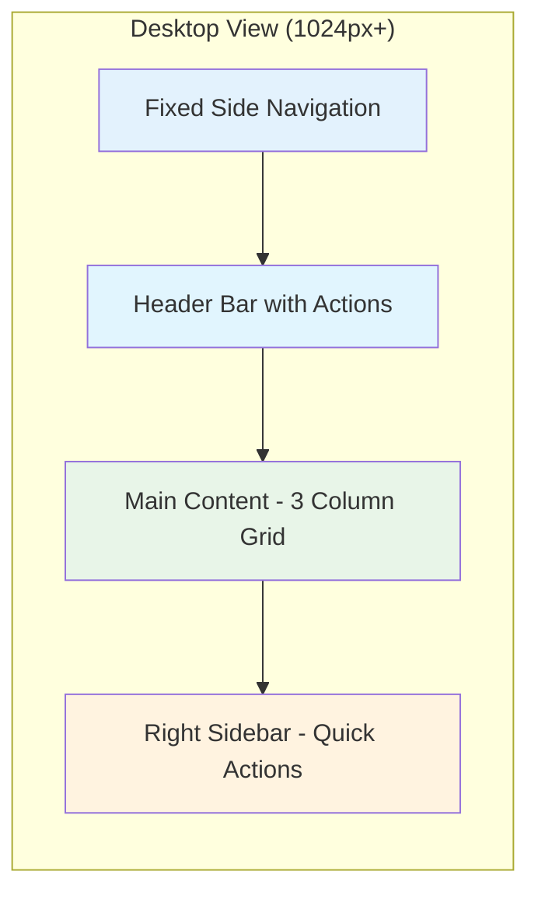

# IEEE Management System - UI/UX Design Mockups

## Dashboard Layouts by Role

### Normal Member Dashboard

### HR Member Dashboard

```mermaid
graph TB
    subgraph "HR Member Dashboard"
        A[Header with IEEE Logo & Theme Toggle]
        B[Welcome Message with HR Member Name]
        C[Navigation: Profile - Members - Attendance - Behaviors - Reports]

        subgraph "Main Content Area"
            D[Committee Members Overview]
            E[Attendance Tracking Panel]
            F[Behavior Management Panel]
            G[Quick Actions: Rate Attendance, Add Behavior]
            H[Monthly Reports Summary]
        end

        I[Footer]
    end

    A --> B
    B --> C
    C --> D
    D --> E
    E --> F
    F --> G
    G --> H
    H --> I

    style A fill:#e1f5fe
    style D fill:#fff3e0
    style E fill:#fff3e0
    style F fill:#fff3e0
    style G fill:#fff3e0
    style H fill:#fff3e0
```

### Head Member Dashboard

```mermaid
graph TB
    subgraph "Head Member Dashboard"
        A[Header with IEEE Logo & Theme Toggle]
        B[Welcome Message with Head Member Name]
        C[Navigation: Profile - Committee - Assignments - Tasks - Members - Meetings]

        subgraph "Main Content Area"
            D[Committee Overview & Statistics]
            E[Assignment Review Panel]
            F[Task Management Panel]
            G[Member Management Panel]
            H[Meeting Agenda Creator]
            I[Committee Posts Panel]
        end

        J[Footer]
    end

    A --> B
    B --> C
    C --> D
    D --> E
    E --> F
    F --> G
    G --> H
    H --> I
    I --> J

    style A fill:#e1f5fe
    style D fill:#f3e5f5
    style E fill:#f3e5f5
    style F fill:#f3e5f5
    style G fill:#f3e5f5
    style H fill:#f3e5f5
    style I fill:#f3e5f5
```

### High Board Member Dashboard

```mermaid
graph TB
    subgraph "High Board Member Dashboard"
        A[Header with IEEE Logo & Theme Toggle]
        B[Welcome Message with High Board Member Name]
        C[Navigation: Profile - All Committees - Events - General Meetings - Leadership - Analytics]

        subgraph "Main Content Area"
            D[Organization Overview & KPIs]
            E[All Committees Management]
            F[Event Planning & Management]
            G[General Meeting Scheduler]
            H[Leadership Rating Panel]
            I[Committee Creation Panel]
            J[Branch Analytics Dashboard]
        end

        K[Footer]
    end

    A --> B
    B --> C
    C --> D
    D --> E
    E --> F
    F --> G
    G --> H
    H --> I
    I --> J
    J --> K

    style A fill:#e1f5fe
    style D fill:#e3f2fd
    style E fill:#e3f2fd
    style F fill:#e3f2fd
    style G fill:#e3f2fd
    style H fill:#e3f2fd
    style I fill:#e3f2fd
    style J fill:#e3f2fd
```

## User Interaction Flows

### Assignment Management Flow

### Attendance Tracking Flow

### Committee Creation Flow

## Responsive Design Layouts

### Mobile Layout

### Tablet Layout

### Desktop Layout

