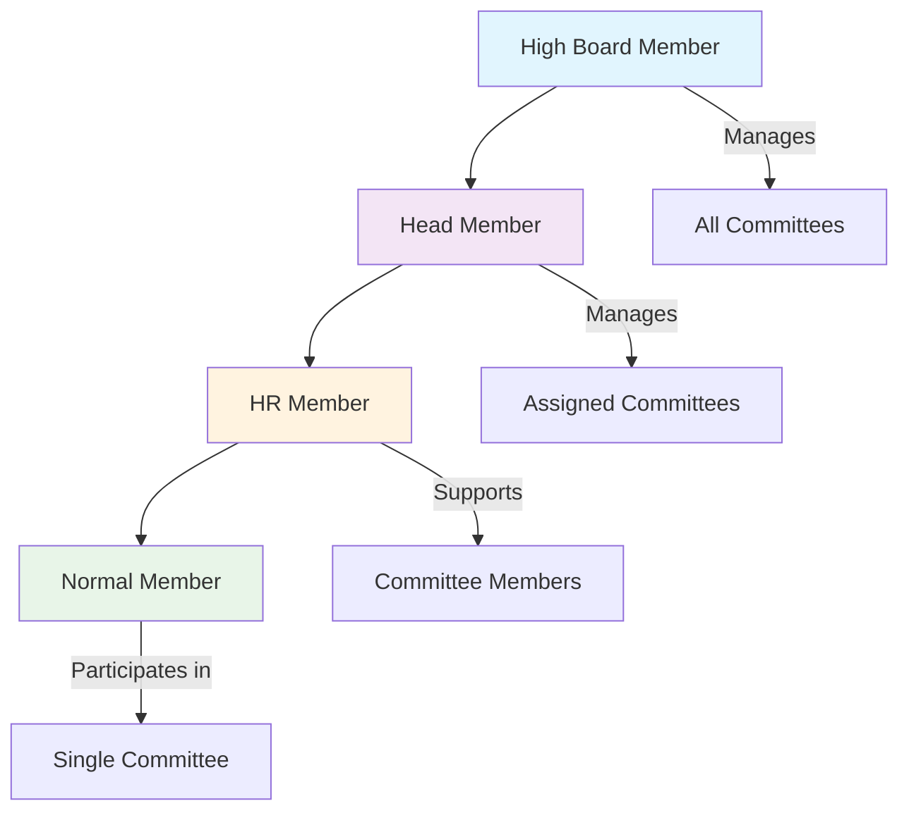
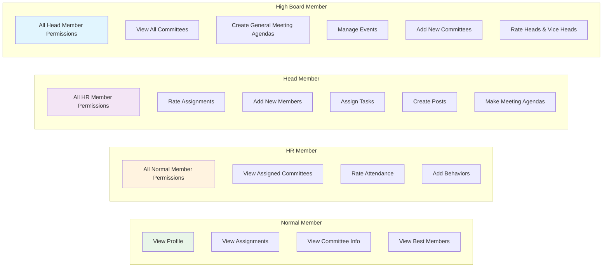
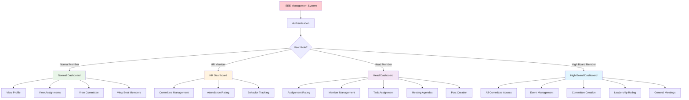
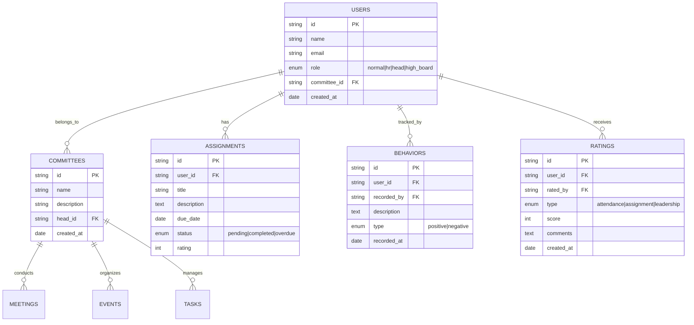

# IEEE Management System - User Roles and Permissions

## Role Hierarchy Diagram

```mermaid
graph TD
    A[High Board Member] --> B[Head Member]
    B --> C[HR Member]
    C --> D[Normal Member]

    A --> |Manages| E[All Committees]
    B --> |Manages| F[Assigned Committees]
    C --> |Supports| G[Committee Members]
    D --> |Participates in| H[Single Committee]

    style A fill:#e1f5fe
    style B fill:#f3e5f5
    style C fill:#fff3e0
    style D fill:#e8f5e8
```

## Permissions Matrix

```mermaid
graph LR
    subgraph "Normal Member"
        NM1[View Profile]
        NM2[View Assignments]
        NM3[View Committee Info]
        NM4[View Best Members]
    end

    subgraph "HR Member"
        HR1[All Normal Member Permissions]
        HR2[View Assigned Committees]
        HR3[Rate Attendance]
        HR4[Add Behaviors]
    end

    subgraph "Head Member"
        H1[All HR Member Permissions]
        H2[Rate Assignments]
        H3[Add New Members]
        H4[Assign Tasks]
        H5[Create Posts]
        H6[Make Meeting Agendas]
    end

    subgraph "High Board Member"
        HB1[All Head Member Permissions]
        HB2[View All Committees]
        HB3[Create General Meeting Agendas]
        HB4[Manage Events]
        HB5[Add New Committees]
        HB6[Rate Heads & Vice Heads]
    end

    style NM1 fill:#e8f5e8
    style HR1 fill:#fff3e0
    style H1 fill:#f3e5f5
    style HB1 fill:#e1f5fe
```

## System Architecture Flow

```mermaid
flowchart TD
    A[IEEE Management System] --> B[Authentication]
    B --> C{User Role?}

    C --> |Normal Member| D[Normal Dashboard]
    C --> |HR Member| E[HR Dashboard]
    C --> |Head Member| F[Head Dashboard]
    C --> |High Board Member| G[High Board Dashboard]

    D --> D1[View Profile]
    D --> D2[View Assignments]
    D --> D3[View Committee]
    D --> D4[View Best Members]

    E --> E1[Committee Management]
    E --> E2[Attendance Rating]
    E --> E3[Behavior Tracking]

    F --> F1[Assignment Rating]
    F --> F2[Member Management]
    F --> F3[Task Assignment]
    F --> F4[Meeting Agendas]
    F --> F5[Post Creation]

    G --> G1[All Committee Access]
    G --> G2[Event Management]
    G --> G3[Committee Creation]
    G --> G4[Leadership Rating]
    G --> G5[General Meetings]

    style A fill:#ffcdd2
    style D fill:#e8f5e8
    style E fill:#fff3e0
    style F fill:#f3e5f5
    style G fill:#e1f5fe
```

## Data Access Patterns

```mermaid
erDiagram
    USERS ||--o{ COMMITTEES : "belongs_to"
    USERS ||--o{ ASSIGNMENTS : "has"
    USERS ||--o{ BEHAVIORS : "tracked_by"
    USERS ||--o{ RATINGS : "receives"

    COMMITTEES ||--o{ MEETINGS : "conducts"
    COMMITTEES ||--o{ EVENTS : "organizes"
    COMMITTEES ||--o{ TASKS : "manages"

    USERS {
        string id PK
        string name
        string email
        enum role "normal|hr|head|high_board"
        string committee_id FK
        date created_at
    }

    COMMITTEES {
        string id PK
        string name
        string description
        string head_id FK
        date created_at
    }

    ASSIGNMENTS {
        string id PK
        string user_id FK
        string title
        text description
        date due_date
        enum status "pending|completed|overdue"
        int rating
    }

    BEHAVIORS {
        string id PK
        string user_id FK
        string recorded_by FK
        text description
        enum type "positive|negative"
        date recorded_at
    }

    RATINGS {
        string id PK
        string user_id FK
        string rated_by FK
        enum type "attendance|assignment|leadership"
        int score
        text comments
        date created_at
    }
```
